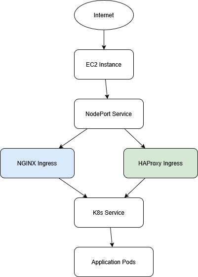

# Kubernetes Ingress Migration & Benchmarking

## Objective
Deploy a Kubernetes-based application on AWS EC2 using Terraform and evaluate multiple ingress controllers under load.

- Implement multiple ingress controllers:
  - NGINX Ingress Controller
  - Traefik Proxy
  - HAProxy Kubernetes Ingress
- Perform load testing using k6
- Compare performance under high concurrency
- Identify the best production-ready ingress controller

---

## Project Structure

```
k8s-ingress-migration/
├── main.tf
├── variables.tf
├── keypair.tf
├── provider.tf
├── ec2.tf
├── security.tf
├── output.tf
├── userdata.sh
├── test.js
├── charts/
│   ├── my-nginx/
│   ├── values.yaml
│   ├── values-haproxy.yaml
│   └── values-traefik.yaml
└── README.md
```

---

## Architecture

### Visual Diagram


### Initial Setup (Logical Flow)

```
Internet
   ↓
EC2 Public IP
   ↓
NodePort
   ↓
NGINX Ingress
   ↓
Kubernetes Service
   ↓
Nginx Application (Deployment)
```

---

## Migration Architecture

```
        DNS / Load Balancer
                 │
   ┌─────────────┴─────────────┐
   │                           │
NGINX Ingress           HAProxy Ingress
   │                           │
   └──────────→ Same Service ←─┘
                 │
          Application Pods
```

- Multiple ingress controllers route traffic to the same backend service  
- Enables live comparison and zero-downtime migration testing  

---

## Install Ingress Controllers

### NGINX
```bash
helm install ingress-nginx ingress-nginx/ingress-nginx \
  -n ingress-nginx \
  --create-namespace \
  -f values-ingress.yaml
```

### HAProxy (Primary Candidate)
```bash
helm upgrade --install haproxy haproxytech/kubernetes-ingress \
  -n haproxy \
  --create-namespace \
  -f values-haproxy.yaml
```

### Traefik (Comparison)
```bash
helm install traefik traefik/traefik \
  -n traefik \
  --create-namespace \
  -f values-traefik.yaml
```

---

## Deploy Application

```bash
helm install my-nginx . -f values.yaml

helm upgrade --install my-nginx-haproxy . -f values-haproxy.yaml

helm upgrade --install my-nginx-traefik . -f values-traefik.yaml
```

---

## Verification

```bash
curl -H "Host: myapp.local" http://<EC2-PUBLIC-IP>:<NODEPORT>
```

---

## Load Testing (k6)

Load testing was performed using k6 to simulate real-world traffic under high concurrency.

### Test Configuration
- Virtual Users: 200  
- Duration: 1 minute  
- Scenario: constant load  

---

## Performance Comparison (200 VUs)

| Metric               | NGINX     | HAProxy   | Traefik   |
|---------------------|----------|----------|----------|
| Average Latency     | 277.76 ms | 274.02 ms | 282.44 ms |
| Median Latency      | 272.47 ms | 271.04 ms | 273.85 ms |
| p90 Latency         | 292.49 ms | 287.95 ms | 297.79 ms |
| p95 Latency         | 303.82 ms | 297.97 ms | 323.21 ms |
| Max Latency         | 894.62 ms | 749.07 ms | 1050 ms   |
| Throughput (req/sec)| 712.73    | 723.05    | 701.62    |
| Total Requests      | 42956     | 43537     | 42283     |
| Failed Requests     | 0%        | 0%        | 0%        |

---

## Key Findings

- HAProxy performed best overall  
- Lowest average latency  
- Best p90 and p95 latency  
- Highest throughput  
- Lowest latency spikes under load  

---

## Gateway API / Future Direction

Although Kubernetes promotes the Gateway API:

- Controller implementations are still evolving  
- API gateway-style integrations remain experimental in many cases  

NGINX Gateway Fabric introduces:
- Additional CRD complexity  
- Installation challenges  
- Version compatibility issues  

For production workloads today:
- Traditional Ingress remains the most stable approach  

---

## Conclusion

- HAProxy is a strong production-grade alternative to NGINX Ingress  
- Provides better performance under load  
- Suitable for high-throughput, low-latency applications  
- Avoids reliance on experimental Kubernetes features  

---

## Future Improvements

- Evaluate Gateway API once stable  
- Compare with service mesh (Istio / Linkerd)  
- Automate benchmarking pipeline  
